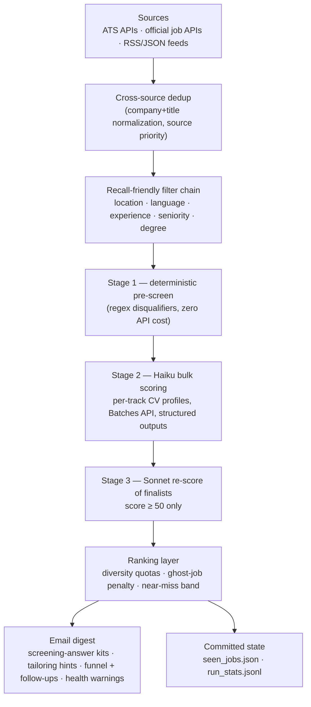

# Job Hunter — an autonomous AI job-search pipeline


Twice a day, this pipeline scans **300+ company job boards and public job APIs**, filters
thousands of postings down to the handful worth applying to, scores each one against
track-specific CV profiles with a two-stage Claude pipeline, and delivers a ranked
email digest — with pre-drafted screening answers, keyword-gap tailoring hints,
freshness badges, and an application funnel tracker.

Built and maintained by [Sherwan Ali](https://github.com/SherwanAli0) as a real
daily-driver (it has processed **19,000+ unique postings** since May 2026), and as a
showcase of production-minded LLM engineering on a shoestring budget (**~€3–5/month
all-in**, roughly halved again by the Batches API + prompt-caching layer).

---

## Architecture



**Sources** (all public interfaces): Greenhouse, Lever, Ashby, Personio, Recruitee,
SmartRecruiters and Workday endpoints across 300+ company boards; the official
**Bundesagentur für Arbeit** job-search API; the **Adzuna** API; the **Brave Search**
API; and public feeds (Arbeitnow, Remotive, WorkingNomads, WeWorkRemotely RSS) plus
other public job boards. A monthly health-check workflow probes every configured board
and fails CI when boards die, so the source list can't silently rot.

## What makes it interesting

**Two-stage LLM scoring with per-track CV routing.** Every surviving job is
classified (AI / ML / Data Science / Data Analyst) and judged against a CV profile
*framed for that track* — a Data Scientist job is scored against the DS-framed CV,
not a generic one. Haiku does the cheap bulk pass; Sonnet re-scores only the
finalists. Structured outputs guarantee valid JSON; a retry + score-default layer
guarantees a bad API moment can never crash the run or silently lose jobs.

**A measured scoring pipeline, not vibes.** A hand-labeled golden set
([golden/](golden/golden_set.jsonl)) gates the deterministic pre-screen in CI on
every push, and [calibrate.py](calibrate.py) measures LLM band accuracy on demand
before any prompt edit ships. The calibration set caught a real filter bug on its
first run ("ideally 2–3 years" being read as a 3-year wall).

**Recall-then-precision filtering.** The pre-scorer filter chain is deliberately
recall-friendly (unknown location → keep) while the scorer's disqualifier is the
precision stage — both share one source of truth ([filters.py](filters.py)) so the
two stages can't drift apart. The filter chain is covered by regression tests seeded
with real incidents that once killed good jobs.

**Cost engineering.** Message Batches API (−50% on all tokens), prompt caching on
the per-track system prompts, a deterministic pre-screen that keeps most jobs away
from the API entirely, and a two-model cascade. Scoring thousands of postings a day
costs a few cents.

**Observability.** Every run appends a stats line to
[run_stats.jsonl](run_stats.jsonl) (per-source counts, filter drops, score
distribution, digest mix). A source that historically delivers jobs but returns
zero for 3 straight runs triggers a red warning banner *inside the digest email* —
a dead scraper surfaces next-day, not never.

**Privacy architecture.** The repo is public, so personal data lives outside it by
design: contact/salary facts in a GitHub Secret (with a gitignored local mirror),
the application tracker synced to a secret via `gh` instead of committed, drafted
answers persisted via Actions cache. Git history was scrubbed accordingly.

## Design decisions

- **No auto-apply, by choice.** Major ATS platforms require authenticated,
  server-side integrations for submissions, and job boards prohibit automated
  applications. This pipeline optimizes the *human* application instead:
  pre-drafted screening answers, direct apply links, keyword gaps, and follow-up
  reminders. Applying stays a deliberate act — as it should.
- **Filters fail open, the scorer fails closed.** Cheap regex filters keep
  anything ambiguous; the LLM stage (which can read the description) makes the
  precision call. False negatives are unrecoverable; false positives cost a cent.
- **State is auditable.** Seen-job ids carry last-seen dates and prune after 60
  days; every run's behaviour is one JSON line in the repo history.

## Repo tour

| File | Role |
|---|---|
| [main.py](main.py) | Orchestrator: scrape → dedup → filter → score → rank → notify |
| [scrapers.py](scrapers.py) | All source integrations |
| [scorer.py](scorer.py) | Pre-screen + two-stage Claude scoring, Batches API layer |
| [filters.py](filters.py) | Shared Germany-eligibility term lists (single source of truth) |
| [notifier.py](notifier.py) | HTML digest email (+ optional Notion) |
| [application_kit.py](application_kit.py) | Fetches real screening questions, drafts answers |
| [track.py](track.py) | Application tracker: funnel stats + follow-up nudges |
| [calibrate.py](calibrate.py) / [golden/](golden/) | Scoring calibration harness + labeled set |
| [health_check.py](health_check.py) | Monthly board-rot detector |
| [tests/](tests/) | 85 offline tests, run on every push |

## Run your own

1. **Fork the repo** and edit [config.py](config.py): your CV profiles, search
   queries, and target boards.
2. **Add repository secrets** (Settings → Secrets and variables → Actions):

   | Secret | Purpose |
   |---|---|
   | `ANTHROPIC_API_KEY` | Scoring ([console.anthropic.com](https://console.anthropic.com)) |
   | `GMAIL_USER` / `GMAIL_APP_PASSWORD` / `GMAIL_TO` | Digest delivery (use an [app password](https://myaccount.google.com/security)) |
   | `ADZUNA_APP_ID` / `ADZUNA_APP_KEY` | Optional — [developer.adzuna.com](https://developer.adzuna.com), free tier |
   | `BRAVE_API_KEY` | Optional — Brave Search API |
   | `APPKIT_FACTS` | Optional — personal fact sheet for screening-answer drafting |
   | `NOTION_TOKEN` / `NOTION_DATABASE_ID` | Optional — Notion mirror |

3. **Enable Actions.** The daily workflow runs at 05:00 and 13:00 UTC; trigger it
   manually from the Actions tab to test. Tests run on every push.

Local run:

```bash
pip install -r requirements.txt
export ANTHROPIC_API_KEY=sk-ant-...
python main.py --dry-run   # full pipeline, no email, no state updates
pytest tests/ -q           # offline test suite
```
