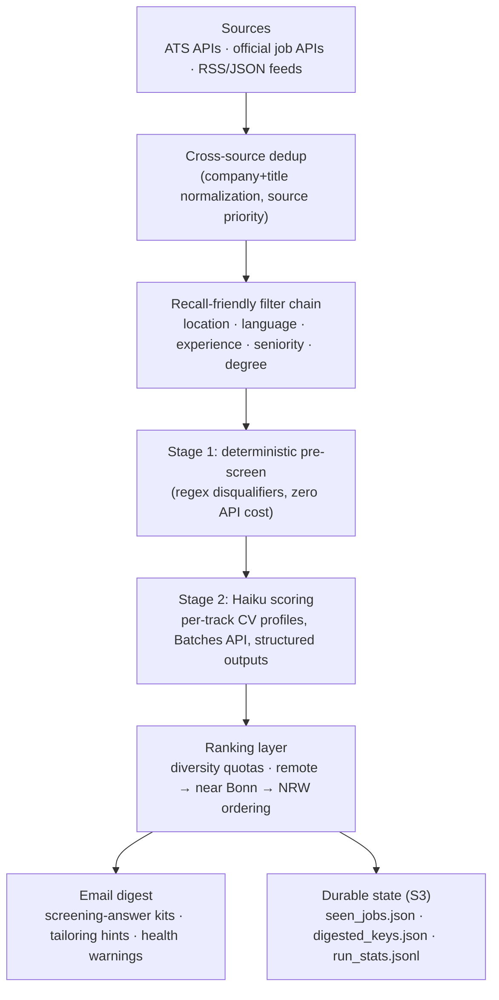

# Job Hunter: an autonomous AI job-search pipeline


Every morning, this pipeline scans **300+ company job boards and public job APIs**, filters
thousands of postings down to the handful worth applying to, scores each one against
track-specific CV profiles with Claude Haiku, and delivers a ranked email digest with
pre-drafted screening answers, keyword-gap tailoring hints and freshness badges.

It runs on **AWS Fargate**, scheduled by EventBridge, with state in S3 and secrets in
SSM Parameter Store. Deploys are automatic from `main` over GitHub OIDC, with no
long-lived AWS keys anywhere.

Built and maintained by [Sherwan Ali](https://github.com/SherwanAli0) as a real
daily-driver (it has processed **19,000+ unique postings** since May 2026), and as a
showcase of production-minded LLM engineering on a shoestring budget: scoring and compute
measure about **0.05 USD per run**, with the Batches API, prompt caching and a free
keyword gate keeping most postings away from the model.

---

## Architecture


```mermaid
flowchart TD
    A["Sources<br/>ATS APIs · official job APIs · RSS/JSON feeds"] --> B["Cross-source dedup<br/>(company+title normalization, source priority)"]
    B --> C["Recall-friendly filter chain<br/>location · language · experience · seniority · degree"]
    C --> D["Stage 1: deterministic pre-screen<br/>(regex disqualifiers, zero API cost)"]
    D --> E["Stage 2: Haiku scoring<br/>per-track CV profiles, Batches API, structured outputs"]
    E --> G["Ranking layer<br/>diversity quotas · remote → near Bonn → NRW ordering"]
    G --> H["Email digest<br/>screening-answer kits · tailoring hints · health warnings"]
    G --> I["Durable state (S3)<br/>seen_jobs.json · digested_keys.json · run_stats.jsonl"]
```

**Runtime.** The whole pipeline is one container image. EventBridge Scheduler starts an
ECS Fargate task every day at 10:00 Europe/Berlin (so daylight saving is handled for me);
the task reads its secrets from SSM Parameter Store as SecureStrings, reads and writes
state in a versioned private S3 bucket, and logs structured JSON to CloudWatch. Fargate
was chosen over Lambda only after measuring the real scrape: a full run takes about 40
minutes, well past Lambda's 15-minute ceiling. A push to `main` runs the tests, builds
the image, pushes it to ECR and registers a new task definition revision, authenticating
with GitHub OIDC against a least-privilege role.

Two concurrent runs would each see the same jobs as unseen and both send a digest, so
runs take a claim in S3 (conditional write, a TTL longer than the slowest healthy run,
and an owner token so a run that overran cannot release its successor's claim) and a
second run exits cleanly instead of failing. A state file that exists but cannot be
read stops the run: carrying on with empty history would re-send old jobs.

**Sources** (all public interfaces): Greenhouse, Lever, Ashby, Personio, Recruitee,
SmartRecruiters and Workday endpoints across 300+ company boards; the official
**Bundesagentur für Arbeit** job-search API; the **Adzuna** API; the **Brave Search**
API; and public feeds (Arbeitnow, Remotive, WorkingNomads, WeWorkRemotely RSS) plus
other public job boards. A monthly health-check workflow probes the configured
Greenhouse, Lever, Ashby, Personio, Recruitee and SmartRecruiters boards and fails CI
when one has been removed, so the source list can't silently rot.

## What makes it interesting

**LLM scoring with per-track CV routing.** Every surviving job is classified
(AI / ML / Data Science / Data Analyst) and judged by Claude Haiku against a CV profile
*framed for that track*: a Data Scientist job is scored against the DS-framed CV,
not a generic one. A Sonnet re-score of the finalists used to follow; it was measured
at a third of every run's bill for a second opinion on an order Haiku had already set,
and removed. Structured outputs guarantee valid JSON, and a retry plus score-default
layer guarantees a bad API moment can never crash the run or silently lose jobs.

**A measured scoring pipeline, not vibes.** A hand-labeled golden set
([golden/](golden/golden_set.jsonl)) gates the deterministic pre-screen in CI on
every push, and [calibrate.py](calibrate.py) measures LLM band accuracy on demand
before any prompt edit ships. The calibration set caught a real filter bug on its
first run ("ideally 2-3 years" being read as a 3-year wall).

**Recall-then-precision filtering.** The pre-scorer filter chain is deliberately
recall-friendly (unknown location is kept), while the scorer's disqualifier is the
precision stage. Both share one source of truth ([filters.py](filters.py)) so the
two stages can't drift apart. The filter chain is covered by regression tests seeded
with real incidents that once killed good jobs.

**Cost engineering.** Message Batches API (50% off all tokens), prompt caching on
the per-track system prompts, a free keyword gate built from the CV, and a
deterministic pre-screen that keeps most jobs away from the API entirely. Every run
records its exact token usage, priced per request mode and cache TTL. Scoring
thousands of postings a day costs a few cents.

**Observability.** Every run appends a stats line to `run_stats.jsonl` in the S3
state bucket (per-source counts, filter drops, score distribution, digest mix, token
usage). A source that historically delivers jobs but returns zero for 3 straight runs,
or one that has been silent past a grace period, triggers a red warning banner *inside
the digest email*. Sources switched off on purpose are listed as retired so their
alarm does not become noise. A digest that cannot be sent fails the run.

**Losses are measured, not assumed.** An October 2026 audit traced where suitable jobs
were lost before any rule could judge them, and each fix carries a regression test:
half the search queries never ran after the schedule went to once a day, job ads
whose page failed to load were marked seen and never retried, a location written as
just "Düsseldorf" was dropped by two board integrations, and keyword and page caps
cut student roles before they were read.

**Privacy architecture.** The repo is public, so personal data lives outside it by
design: contact/salary facts in SSM Parameter Store (with a gitignored local mirror),
drafted answers in the private S3 state bucket, and the application tracker kept
outside the repository. Git history was scrubbed accordingly.

## Design decisions

- **No auto-apply, by choice.** Major ATS platforms require authenticated,
  server-side integrations for submissions, and job boards prohibit automated
  applications. This pipeline optimizes the *human* application instead:
  pre-drafted screening answers, direct apply links, keyword gaps, and follow-up
  reminders. Applying stays a deliberate act, as it should.
- **Filters fail open, the scorer fails closed.** Cheap regex filters keep
  anything ambiguous; the LLM stage (which can read the description) makes the
  precision call. False negatives are unrecoverable; false positives cost a cent.
- **State is auditable.** Seen-job ids carry last-seen dates and prune after 60
  days; every run's behaviour is one JSON line of run stats.
- **What it hunts is configuration, not architecture.** The target changed
  completely once already: it looked for junior full-time roles until its owner
  was admitted to an M.Sc. in Bonn, and now looks only for Werkstudent (working-student), internship and
  part-time (Teilzeit) IT roles, English-language ads only: remote or hybrid anywhere
  in Germany, on-site only in North Rhine-Westphalia or the Bonn belt.
  That pivot touched the CV profiles and query lists in
  [config.py](config.py), one required-employment-form filter, one location-ranking rule,
  and the labels on the calibration set. The regression suite is what made it
  safe: it caught the spots where the old assumption had leaked into unrelated
  code, including a language filter that treated the word "Werkstudent" itself
  as evidence that a posting was written in German.
- **Measurement outranks intuition.** The first live run of that new target
  returned an empty digest, and the per-filter drop counters said why: the
  ad-language filter had removed 62 of the 76 reachable student roles. The
  German student market advertises in German, so the language of the
  advertisement had stopped being evidence about the job, so for three weeks
  the filter applied only the explicit language *requirement* to student
  roles. Then the owner, who reads German at B1, decided that digests full of
  German ads were not worth his time and reversed it: since 2026-09-07 only
  ads whose body reads as English are sent, stub bodies are fetched in full
  before being judged, and the search runs Germany-wide for remote and
  hybrid roles (on-site only in NRW) with the digest ordered remote → near
  Bonn → NRW → elsewhere, so the smaller English pool is as large as it can be. A funnel that reports what each stage killed turns a
  silent empty inbox into a one-line diagnosis.

## Repo tour

| File | Role |
|---|---|
| [main.py](main.py) | Orchestrator: scrape → dedup → filter → score → rank → notify |
| [scrapers.py](scrapers.py) | All source integrations |
| [scorer.py](scorer.py) | Pre-screen + Claude Haiku scoring, Batches API layer |
| [filters.py](filters.py) | Shared Germany-eligibility term lists (single source of truth) |
| [notifier.py](notifier.py) | HTML digest email (+ optional Notion) |
| [application_kit.py](application_kit.py) | Fetches real screening questions, drafts answers |
| [track.py](track.py) | Application tracker: funnel stats + follow-up nudges |
| [calibrate.py](calibrate.py) / [golden/](golden/) | Scoring calibration harness + labeled set |
| [health_check.py](health_check.py) | Monthly board-rot detector |
| [handler.py](handler.py) / [storage.py](storage.py) | AWS entrypoint, S3 state and the overlap claim guard |
| [tests/](tests/) | 545 offline tests, run on every push |

## Run your own

Production runs on AWS: the [deploy workflow](.github/workflows/deploy.yml) builds the
image and registers the task definition, and [aws/](aws/) holds the task, schedule and
IAM definitions. The simplest way to run your own copy is the GitHub Actions workflow
[daily.yml](.github/workflows/daily.yml), kept as a fallback with its schedule disabled.

1. **Fork the repo** and edit [config.py](config.py): your CV profiles, search
   queries, and target boards.
2. **Add repository secrets** (Settings → Secrets and variables → Actions):

   | Secret | Purpose |
   |---|---|
   | `ANTHROPIC_API_KEY` | Scoring ([console.anthropic.com](https://console.anthropic.com)) |
   | `GMAIL_USER` / `GMAIL_APP_PASSWORD` / `GMAIL_TO` | Digest delivery (use an [app password](https://myaccount.google.com/security)) |
   | `ADZUNA_APP_ID` / `ADZUNA_APP_KEY` | Optional: [developer.adzuna.com](https://developer.adzuna.com), free tier |
   | `BRAVE_API_KEY` | Optional: Brave Search API |
   | `APPKIT_FACTS` | Optional: personal fact sheet for screening-answer drafting |
   | `NOTION_TOKEN` / `NOTION_DATABASE_ID` | Optional: Notion mirror |

3. **Enable the "Daily Job Hunt" workflow** (`gh workflow enable "Daily Job Hunt"`).
   Its cron runs at 05:00 and 13:00 UTC; trigger it manually from the Actions tab to
   test. Tests run on every push.

Local run:

```bash
pip install -r requirements.txt
export ANTHROPIC_API_KEY=sk-ant-...
python main.py --dry-run   # full pipeline, no email, no state updates
pytest tests/ -q           # offline test suite
```
